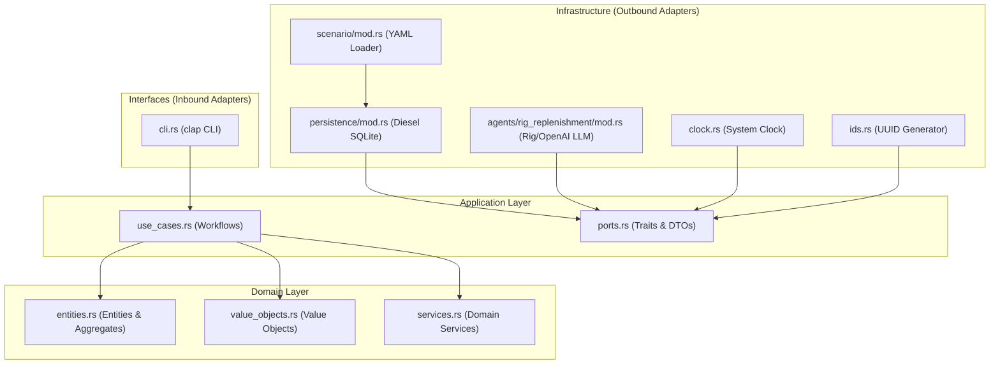

# Architecture

Last updated: 2026-06-10

## Overview

`rigagent` is an autonomous retail replenishment workflow demo. It seeds a small
apparel shop, advances deterministic sales simulation, asks a Rig-backed
decision agent for supplier restock proposals, validates those proposals in Rust,
and persists accepted restock orders in SQLite through Diesel.

The application is intentionally not a chat assistant or REPL. The binary is a
workflow runner with four commands:

- `seed`: create retail state from scenario YAML.
- `simulate`: advance deterministic sales and inventory state.
- `decide`: run one replenishment decision.
- `run-cycle`: run repeated simulation and decision turns.

## Dependency Rule

The code follows clean-architecture dependency direction:

```text
interfaces -> application -> domain
infrastructure -> application -> domain
```

The domain layer is the center. It owns retail language and rules and does not
depend on Diesel, Rig, Clap, config loading, environment variables, async
runtimes, provider payloads, or tracing.

Application code owns use-case orchestration and outbound ports. Infrastructure
implements those ports. Interfaces adapt CLI input and output.

## Architectural Layers & Boundaries

The codebase strictly adheres to the dependency inversion principle, with dependencies pointing inward toward the business logic core. 




### Domain Layer (`src/domain/retail/`)
- **Isolation:** Contains zero dependencies on database drivers, CLI flags, configuration loaders, serialization frameworks, or async runtimes. It only depends on the Rust standard library and domain-specific crates.
- **Rich Models:** Aggregates and entities like `InventoryPosition` and `RestockOrder` contain validation logic and business behaviors directly (e.g., `inventory.receive_restock_with_capacity(...)`). Mutating operations enforce business rules immediately and prevent invalid state transitions.
- **Value Objects:** Enforce invariants on construction (e.g. `Sku`, `Brand`, `MoneyCents`, `StockQuantity`). Floating-point mathematics is completely avoided, using fixed-point representation (e.g., `DemandRatePerDay` storing milli-units per day) to ensure precision.

### Application Layer (`src/application/retail/`)
- **Orchestration:** Coordinates business workflows inside `use_cases.rs` using outbound ports defined as traits in `ports.rs` (e.g., `RetailStore`, `DecisionRunStore`, `ReplenishmentDecisionAgent`, `Clock`, `IdGenerator`).
- **Data Transfer:** Communicates with interfaces and infrastructure strictly via commands (`SeedRetailScenario`, `AdvanceSimulation`, etc.) and read models (`RetailSnapshot`, `DecisionResult`, etc.). ORM models and CLI structs are kept completely out of this layer.
- **Poison-Proof Error Boundaries:** Defines `ApplicationError` which wraps transport/driver/database errors into a generic `SharedError` using `Arc<dyn Error + Send + Sync + 'static>`. This prevents leakage of infrastructure-specific types like `diesel::result::Error` into the application layer.

### Infrastructure Layer (`src/infrastructure/`)
- **Persistence:** Contained in `persistence/mod.rs`. Private SQL schema mappings and Diesel query definitions are fully encapsulated here. Raw query results are mapped into domain models (utilizing `TryFrom` converters for validated construction) before returning to use cases.
- **Agents:** Integrates the Rig framework with OpenAI completion models. Custom completion tools (e.g., `GetInventorySnapshot`, `PlaceRestockOrder`) are encapsulated behind a thread-safe `DecisionSession` containing a poisoned-lock mechanism (`Arc<Mutex<DecisionSession>>`).
- **Decoupled Environment:** Config loader (`config.rs`) uses environment overrides on top of `config.yaml` to configure external parameters cleanly.

### Interfaces Layer (`src/interfaces/`)
- **User Facing:** Adapts raw CLI inputs using `clap` into structured commands. Exit codes are mapped cleanly from CLI error types at the program edge.

## Module Map

```text
src/
+-- main.rs
+-- lib.rs
+-- config.rs
+-- domain/
|   +-- retail/
|       +-- entities.rs
|       +-- errors.rs
|       +-- services.rs
|       +-- value_objects.rs
+-- application/
|   +-- retail/
|       +-- commands.rs
|       +-- errors.rs
|       +-- ports.rs
|       +-- read_models.rs
|       +-- use_cases.rs
+-- infrastructure/
|   +-- agents/
|   |   +-- rig_replenishment/
|   +-- clock.rs
|   +-- ids.rs
|   +-- persistence/
|   +-- scenario/
+-- interfaces/
    +-- cli.rs
```

`src/main.rs` is only the process entrypoint. `src/lib.rs::run()` initializes
tracing, parses CLI input, loads configuration for mutating commands, runs
embedded migrations, builds adapters, and dispatches application use cases.

## Domain Layer

The retail domain is framework-free business code.

Value objects:

- `Sku`, `Brand`, `ApparelKind`, `SizeLabel`
- `MoneyCents`, `SpaceUnits`, `StockQuantity`
- `DemandRatePerDay`, `DemandBacklog`
- `LeadTimeDays`, `DecisionHorizonDays`, `SimulationDate`
- `SalesOrderId`, `RestockOrderId`, `DecisionRunId`

Entities and aggregates:

- `Product`: catalog item, economics, demand, lead time, active state, and order
  quantity bounds.
- `InventoryPosition`: on-hand stock and fractional demand backlog for one SKU.
- `RestockOrder`: supplier order with `Open`, `Received`, or `Cancelled`
  status.
- `SalesOrder`: simulated customer demand, fulfillment, revenue, cost, and lost
  units.
- `DecisionRun`: durable decision lifecycle with `Started`, `Completed`, or
  `Failed` status.

Domain services:

- `DemandSimulator`: converts fixed-point daily demand plus backlog into whole
  requested units and remaining backlog without float arithmetic.
- `RestockOptionScorer`: computes deterministic restock candidates from product
  economics, on-hand inventory, inbound stock, lead time, horizon, and capacity.

All arithmetic that can overflow uses checked or saturating operations. Domain
constructors and behavior methods make invalid state unrepresentable where
practical.

## Application Layer

The application layer coordinates workflows and defines ports for side effects.

Commands:

- `SeedRetailScenario`
- `AdvanceSimulation`
- `RunRestockDecision`
- `RunWorkflowCycle`

Read models:

- `RetailSnapshot`
- `ProfitSummary`
- `AdvanceSimulationResult`
- `DecisionResult`
- `WorkflowCycleResult`
- `EventCount`

Ports:

- `RetailStore`: durable retail state, sales writes, restock writes, snapshots,
  profit summary, and logical shop-date advancement.
- `DecisionRunStore`: start, complete, fail, and load decision runs.
- `ReplenishmentDecisionAgent`: request/response boundary for restock proposals.
- `Clock`: real calendar date only where real time is needed, such as decision
  date and order date.
- `IdGenerator`: typed IDs for sales orders, restock orders, and decision runs.

`RetailWorkflow` is the application service. It receives concrete adapters by
constructor injection and is generic over the port implementations. It does not
read environment variables, create database connections, or know about Rig.

## Runtime Flows

### No Subcommand

`cargo run` renders CLI help and returns without loading configuration, opening a
database, or mutating state.

### Seed

```text
CLI -> lib.rs -> migrations -> RetailWorkflow::seed_scenario
    -> RetailStore::state_exists
    -> RetailStore::seed_scenario
    -> ScenarioYamlLoader -> DieselRetailStore
```

The seed operation loads scenario YAML, converts DTOs into domain types, and
inserts shop state, products, and inventory in one transaction.

### Simulate

```text
CLI -> RetailWorkflow::advance_simulation
    -> load current snapshot
    -> receive due restocks
    -> simulate demand per product
    -> record sales and updated inventory
    -> advance logical shop date
```

The logical simulation date comes from `shop_state.current_date`, not from the
system clock.

### Decide

```text
CLI -> require OPENAI_API_KEY
    -> RetailWorkflow::run_restock_decision
    -> load snapshot
    -> Clock::today for decision/order date
    -> start decision run
    -> score ranked restock options
    -> ReplenishmentDecisionAgent::decide
    -> validate proposals in application/domain code
    -> persist accepted restock orders
    -> complete or fail decision run
```

The Rig adapter may use tools to collect proposals, but durable writes happen
only after application validation.

### Run Cycle

`run-cycle` executes one decision on day zero, then advances one simulated day at
a time. After each configured interval, it runs another decision.

## Infrastructure Layer

Infrastructure implements application ports and owns external details.

Persistence:

- `DieselRetailStore` implements `RetailStore`.
- `DieselDecisionRunStore` implements `DecisionRunStore`.
- `create_pool` builds an r2d2-backed SQLite pool.
- `run_migrations` runs embedded Diesel migrations.
- Diesel schema, row structs, and insert structs remain private to
  `infrastructure::persistence`.
- Row/domain conversion uses `TryFrom` and maps invalid persisted data into
  structured infrastructure errors.
- Multi-write operations run in Diesel transactions.

Scenario loading:

- `ScenarioYamlLoader` deserializes seed YAML into infrastructure DTOs.
- DTOs convert into domain state through validated constructors.
- The loader rejects duplicate SKUs, empty product lists, invalid dates,
  negative values, and initial stock that exceeds capacity.

Agent adapter:

- `RigReplenishmentDecisionAgent` implements `ReplenishmentDecisionAgent`.
- It is constructed only for `decide` and `run-cycle`.
- `OPENAI_API_KEY` is not required for `seed` or `simulate`.
- Rig tools operate on an in-memory `DecisionSession`.
- Tool names are adapter details:
  - `get_inventory_snapshot`
  - `list_open_restock_orders`
  - `analyze_restock_options`
  - `place_restock_order`
  - `get_profit_summary`

Clock and IDs:

- `SystemClock` implements `Clock`.
- `UuidRetailIdGenerator` implements `IdGenerator`.
- Tests use deterministic fakes.

## Persistence Model

The SQLite schema is migration-owned:

- `shop_state`: singleton logical shop date and stock-space capacity.
- `products`: catalog, economics, demand rate, lead time, order bounds, and
  active flag.
- `inventory`: on-hand units and fractional demand backlog by SKU.
- `decision_runs`: decision lifecycle and summary.
- `sales_orders`: simulated customer demand and financial totals.
- `restock_orders`: supplier inbound orders linked to decision runs.

Database constraints mirror important domain invariants, but domain code still
validates state before persistence.

## Error Model

Each layer owns typed errors:

- `DomainError`: violated business invariant or arithmetic/date failure.
- `ApplicationError`: use-case, port, proposal, and orchestration failure.
- `InfrastructureError`: Diesel, migration, pool, serialization, and invalid
  persisted data failure.
- `CliError`: configuration, argument, filesystem, output, and exit-code mapping.

External failures are preserved with `#[source]` or `#[from]`. Infrastructure
errors are wrapped at the application boundary without exposing Diesel or r2d2
types through application ports.

## Configuration

`config.yaml` stores non-secret defaults:

```yaml
chat_model: gpt-5-nano
retail_db_path: data/retail.sqlite
retail_scenario_path: data/retail_scenario.yaml
decision_horizon_days: 14
max_restock_orders_per_decision: 2
```

Environment variables can override matching keys. `OPENAI_API_KEY` is optional
for common config loading and required only when building the Rig-backed
decision adapter.

## Testing Architecture

The test suite is split by boundary:

- Domain tests cover value-object validation, arithmetic, demand carryover,
  product bounds, capacity, and state transitions.
- Application tests use hand-written fakes for stores, decision runs, agents,
  clocks, and IDs, including failure injection.
- Infrastructure tests run real Diesel migrations against isolated SQLite
  databases.
- Interface tests cover CLI parsing, argument validation, default help behavior,
  command mapping, and OpenAI-key requirements.

Required validation before handing back Rust changes:

```bash
cargo fmt --all
cargo clippy --all-targets --all-features -- -D warnings
cargo test --all-features
```

## Extension Rules

When adding behavior:

- Start from domain language and invariants.
- Add application commands, read models, or ports only when a use case needs a
  stable boundary.
- Keep Diesel, Rig, serde DTOs, Clap structs, and config structs out of domain
  and application APIs unless the port is explicitly about that technology.
- Prefer standard conversion traits (`From`, `TryFrom`, `FromStr`, `Display`)
  over ad hoc mapping helpers.
- Preserve source errors and typed context across layer boundaries.
- Keep new tests close to the behavior being protected.
